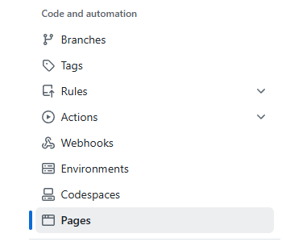
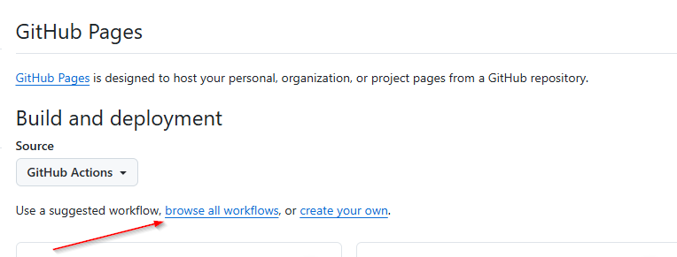
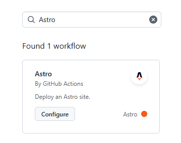
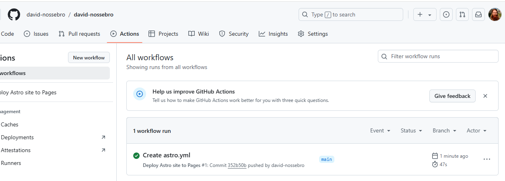
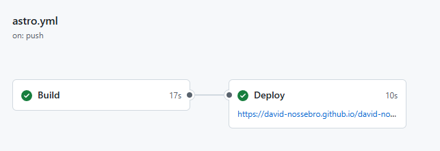

After trying to deploy this blog using Surge as described in this [post](../deploy-static-site-to-surge/index.md) I realized some issues as mentioned in this [post](../why-surge-was-not-a-good-fit/index.md) I decided to try [Github page](https://pages.github.com/).

## Setup a new repository

The first thing I need to do is to create a new repository with the same name as my Github user. In my case a repository called `david-nossebro/david-nossebro`. The content of this repository will be published to [https://david-nossebro.github.io](https://david-nossebro.github.io).

When that was done I pushed the source and content of this Astro blog to the new repository. But since this is not a compiled version with an index.html at the root, some more configuration is needed. 

In the Astro documentation they have instructions on how to deploy an Astro site to Github pages here:
[Configure Astro for GitHub Pages](https://docs.astro.build/en/guides/deploy/github/)

I updated `src/astro.config.mjs` in my Astro project like this:

``` js
// https://astro.build/config  
export default defineConfig({  
    site: 'https://david-nossebro.github.io',
    integrations: [mdx(), sitemap()],  
});
```

I pushed my changes and then headed over to the settings for my new repo `david-nossebro/david-nossebro` at Github. There I opened the "Pages" section:



And in there I changed the `Source` from "Deploy from branch" to "Github Actions". When selected there is a link visible to "browse all workflows":



In there I searched for Astro and found a workflow:



When pressing configure I am presented with a long yaml-file with many different options. I decided to just try it out with the default settings without changing anything to see if it "just works" out of the box. In the top right corner I pressed "Commit changes".

I then headed over to the "Actions" tab:



Opening the latest workflow run "Create astro.yml", I could see the outcome of the build:



Opening the link I can now see my deployed site. Great success! But there is one small issue that I still want to resolve. The URL it was hosted to is [https://david-nossebro.github.io/david-nossebro/](https://david-nossebro.github.io/david-nossebro/) instead of just [https://david-nossebro.github.io](https://david-nossebro.github.io). Has to be some setting that needs to be done. 

