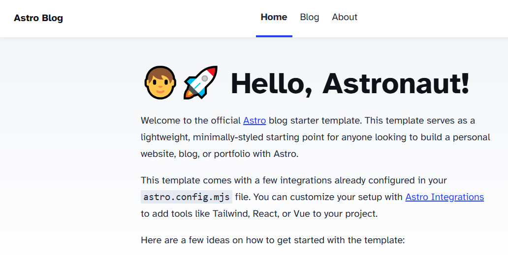
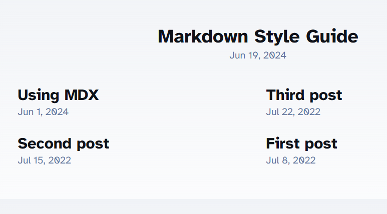
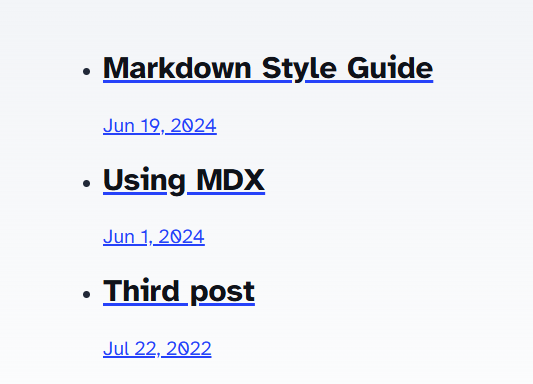
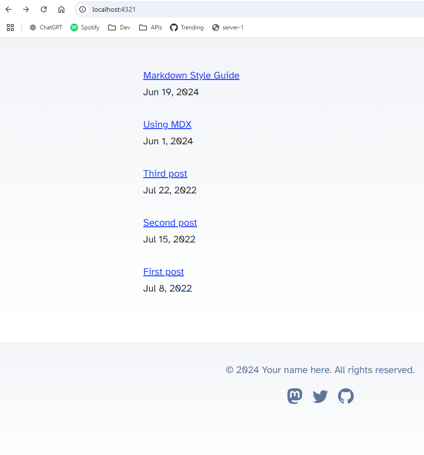
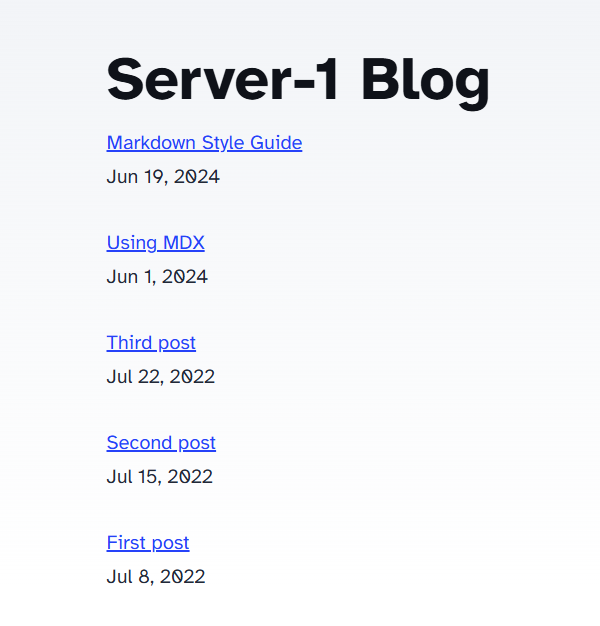
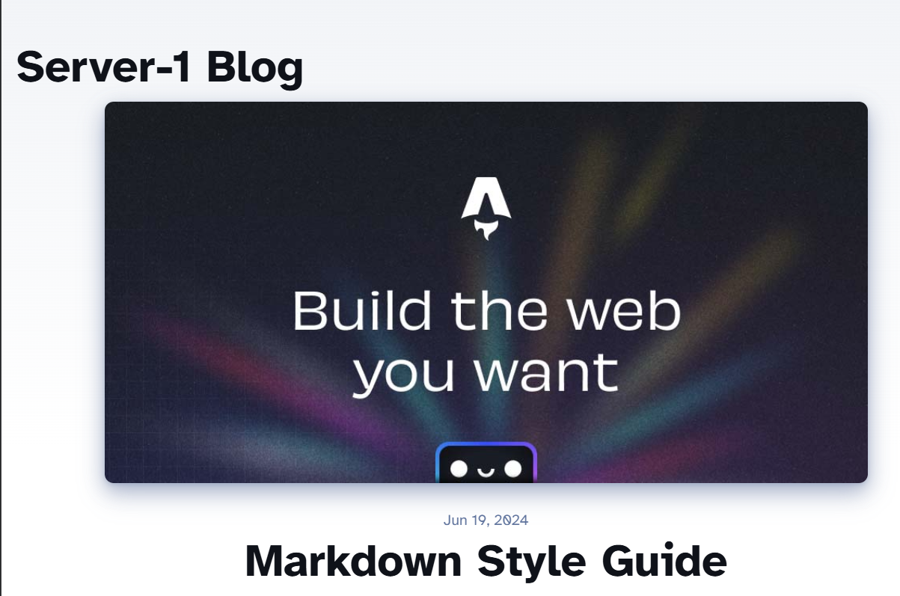
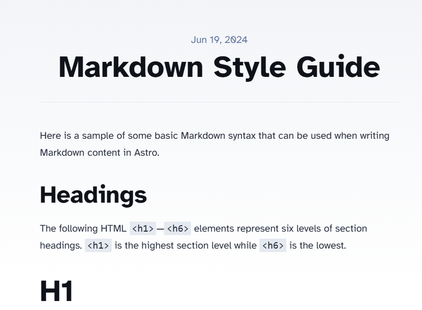
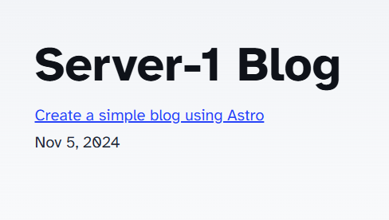
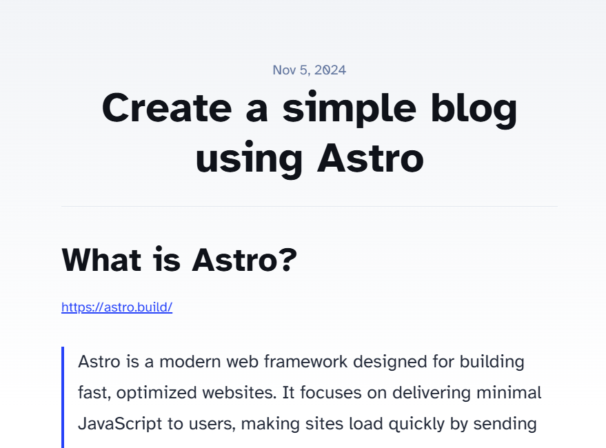

## What is Astro?

[https://astro.build/](https://astro.build/)

> Astro is a modern web framework designed for building fast, optimized websites. It focuses on delivering minimal JavaScript to users, making sites load quickly by sending only what's necessary. Astro generates static HTML by default but can also support dynamic content through integrations with JavaScript frameworks like React, Vue, and Svelte. With Astro, you can write components in different frameworks and combine them into a single site, making it flexible and efficient. Its approach is helpful for blogs, documentation, and content-focused sites where speed and performance are priorities.

By the description I think it is a SSG (static site generator) similar to Gatsby or Hugo. Since I just decided to start this blog and wanted to try something new instead of using Gatsby as I know from before, I decided to give it a shoot. 

## Getting started

To create a new project:
``` bash
npm create astro@latest
```

First you are asked for a location where the new project will be initialized. Then you will be asked for what template we should use:
``` bash
   dir   Where should we create your new project?
         ./server-1-blog

  tmpl   How would you like to start your new project?
         — Include sample files
         > Use blog template
         — Empty
```

Since I am going to build a blog, I selected the blog template.

In the next step I am asked if I want to use TypeScript:
``` bash
    ts   Do you plan to write TypeScript?
         ○ Yes  ● No
```

Since this is a small project I prefer just to use vanilla JavaScript to keep things simple. 

After this I was asked if I want to install dependencies and initiate a git repository, I selected yes for both.

That was all, after some processing I got this message telling me my new project was created:
``` bash
      ✔  Project initialized!
         ■ Template copied
         ■ Dependencies installed
         ■ Git initialized

  next   Liftoff confirmed. Explore your project!

         Enter your project directory using cd ./server-1-blog
         Run npm run dev to start the dev server. CTRL+C to stop.
         Add frameworks like react or tailwind using astro add.

         Stuck? Join us at https://astro.build/chat
```

## First look
I opened up the folder and took a first look at the package.json file:
``` json
{  
  "name": "server-1-blog",  
  "type": "module",  
  "version": "0.0.1",  
  "scripts": {  
    "dev": "astro dev",  
    "start": "astro dev",  
    "build": "astro build",  
    "preview": "astro preview",  
    "astro": "astro"  
  },  
  "dependencies": {  
    "@astrojs/mdx": "^3.1.9",  
    "@astrojs/rss": "^4.0.9",  
    "@astrojs/sitemap": "^3.2.1",  
    "astro": "^4.16.9"  
  }  
}
```

After running `npm start` I got a first look of my new blog at http://localhost:4321/:



## Folder structure explained

This is how the project looks after initialization: 

``` bash
- public/ 
- src/  
    - components/  
    - content/  
    - layouts/  
    - pages/
    - styles/   
- astro.config.mjs
- package.json
- tsconfig.json
```

From the [Astro documentation](https://docs.astro.build/en/basics/project-structure/): 

> Astro leverages an opinionated folder layout for your project. Every Astro project root should include the following directories and files:
> 
> - `src/*` - Your project source code (components, pages, styles, etc.)
> - `public/*` - Your non-code, unprocessed assets (fonts, icons, etc.)
> - `package.json` - A project manifest.
> - `astro.config.mjs` - An Astro configuration file. (recommended)
> - `tsconfig.json` - A TypeScript configuration file. (recommended)

Under the src folder we find the following subfolders:

`src/components` - Components are reusable units of code. These could be Astro components or created with frameworks like React or Vue.

`src/content` - reserved to store content collections (like markdown files) and a configuration file. No other files are allowed inside this folder.

`src/layouts` - Layouts are Astro components that define the UI structure shared by one or more pages.

`src/styles` - Folder for CSS or Sass files.

`public/` - Assets not processed during build e.g. images, fonts, `robot.txt` and `manifest.webmanifest`. Files in this folder are copied into the build folder during build. 

`astro.config.mjs` - Configuration options for your Astro project.

## Code adjustments

### Get rid of the navigation bar

After the first look I realized that I want a much simpler blog than the template. And I have no need for the other pages `Home` and `About`. My first mission will be to remove them and see if I can get rid of the navigation bar.

After looking around I realize that there is a component `Header` that is used in three places:
- `src/layouts/BlogPost.astro`
- `src/pages/index.astro`
- `src/pages/blog`

I went through the files and removed it like this:

``` html
<body>  
  <Header /> <!-- This line was removed -->   
  <main>       
  <article>
  ...
```

After doing this I can see that the navigation is removed from all the pages `/`, `/about` and `/blog`. Big success! :-)

Now I can just remove the `src/components/Header.astro` and all imports of that component. 
### Replace index page with `/blog`

I want the landing page of the blog to be just the blog listing as currently found under `/blog` (even if I want it to look a bit different). To achieve this I am replacing the current `src/pages/index.astro` with `src/pages/blog/index.astro`. 

While at it I am also removing the `src/blog/about.astro` since I do not want it. 

After saving I can now see that I get directly to the blog listing when going to the `/` path. When trying to load `/about` and `/blog` I am getting a 404. Nice!

### Simplify blog listing
Next thing I want to do is simplifying the blog listing. Instead of the big images now shown I want a simple list of the blog entries together with the date they where published.

To achieve this I open up the `src/pages/index.astro` (which was previously the `src/pages/blog/index.astro` file) to have a first look. 

Except for a lot of styles I can see that the blog posts are just a list:

``` html
<ul>
  {
    posts.map((post) => (
      <li>
        <a href={`/blog/${post.slug}/`}>
          
          <h4 class="title">{post.data.title}</h4>
          <p class="date">
            <FormattedDate date={post.data.pubDate} />
          </p>
        </a>
      </li>
    ))
  }
</ul>
```

As we can see in the list we add an image for each post with the ``-tag. That is way to fancy for me. I removed that. 

After saving this is what the blog listing looks like:



That is much better! Let us see what happens if we remove all `<style>` as well:



We are getting there, but the links are still to big, and I do not want the date to be part of the link. I need to do some adjustment to the list in the html like this:

``` html
...
<style>
  .post {
    padding-bottom: 2rem;  
  }  
</style>
...
<section>  
  {  
    posts.map((post) => (  
      <div class="post">  
        <a href={`/blog/${post.slug}/`}>  
          {post.data.title}  
        </a>  
        <div>                 
          <FormattedDate date={post.data.pubDate} />  
        </div>             
      </div>          
    ))  
  }  
</section>
```

Now I have a listing looking like this:



### Fix simple heading and remove footer

The last thing I want to address at the landing page is to remove the footer and add a simple heading for the page.

To remove the footer I simply remove the `src/components/Footer.astro` and see where I get failures in the log:

``` bash
20:47:07 [ERROR] Could not import `/src/components/Footer.astro`.
  Hint:
    This is often caused by a typo in the import path. Please make sure the file exists.
  Error reference:
    https://docs.astro.build/en/reference/errors/failed-to-load-module-ssr/
  Stack trace:
    at loadAndTransform (file:///C:/Users/David/IdeaProjects/server-1-blog/node_modules/vite/dist/node/chunks/dep-BWSbWtLw.js:51920:17)
20:47:15 [ERROR] Could not import `../components/Footer.astro`.
  Hint:
    This is often caused by a typo in the import path. Please make sure the file exists.
  Error reference:
    https://docs.astro.build/en/reference/errors/failed-to-load-module-ssr/
  Stack trace:
    at C:\Users\David\IdeaProjects\server-1-blog\src\pages\index.astro:3:20
    [...] See full stack trace in the browser, or rerun with --verbose.
```

The interesting part here is the reference to:
`C:\Users\David\IdeaProjects\server-1-blog\src\pages\index.astro:3:20`

So if I open up `src/pages/index.astro` I find an import of `Footer` at line 3. I remove that and go further down the file and remove the occurrence in the html as well. After saving the file I can now see that the footer is gone as well. Another big win! :-)

Or... almost a big win. I realized that I also had to remove the `Footer` from `src/layouts/BlogPost.astro`.

The same way I just removed the `Footer` from both  `src/layouts/BlogPost.astro` and `src/pages/index.astro` I need to add a header. This will be done by simply adding a `<h1>Server-1 Blog</h1>`-tag at the top within the `<main>`-tag. That gives us this:

``` html
<body>  
  <main>
    <h1>Server-1 Blog</h1>  
	  <section>
	  ...
```

And a page looking like this:



### Dig into a blog post

Let us see what a single blog post looks like, and what need to be done here:



First thing I want to do is to get rid of the image. I also need to fix the positioning of the header, so that it is placed at the same place as on the index page.

Lets open up `src/layouts/BlogPost.astro` and see what we can do.

In the `<article>` tag I directly spot the image. Lets remove it:

``` html
<div class="hero-image">  
    {heroImage && }  
</div>
```

With that removed we can go to the `<style>` section and remove the `.hero-image`. 

Now we no longer have any need for `heroImage`, so that can be removed as a prop to `BlogPost.astro` here:

``` html
const { title, description, pubDate, updatedDate, heroImage } = Astro.props;
```

Instead of struggling with the style for the header, and because I thought it got ugly with two big headers for a blog post, I decided to just remove the  `Server-1 Blog` header altogether from a blog post. 

With those changes a blog article now looks like this:



### How are the markdown files loaded?

Let us dig into how the markdown files are loaded. After looking around in the project I found this file looking very suspicious: `src/pages/blog/[...slug].astro`.

In this file I found the following code:

``` js
export async function getStaticPaths() {  
    const posts = await getCollection('blog');  
    return posts.map((post) => ({  
       params: { slug: post.slug },  
       props: post,  
    }));  
}  
type Props = CollectionEntry<'blog'>;  
  
const post = Astro.props;  
const { Content } = await post.render();  
---  
  
<BlogPost {...post.data}>  
    <Content />
</BlogPost>
```

The method `getStaticPaths()` seems to be fetching a list of posts. I am guessing that the `getCollection('blog')` call targets the `src/content/blog` folder somehow. In the return of the method we see that we include the `slug` as one `params`. This seems to be used when creating the path for the page to be generated from the markdown together with the `[...slug].astro` filename. For now I am happy enough with guessing how it works. Later on I will dig deeper into the Astro documentation if I have time. Now I am just in hacking mode! :-)

Another file of interest in this structure is `src/content/config.ts`, lets have a look:

``` ts
const blog = defineCollection({  
    type: 'content',  
    // Type-check frontmatter using a schema  
    schema: z.object({  
       title: z.string(),  
       description: z.string(),  
       // Transform string to Date object  
       pubDate: z.coerce.date(),  
       updatedDate: z.coerce.date().optional(),  
       heroImage: z.string().optional(),  
    }),  
});  
  
export const collections = { blog };
```

Here it looks like we define the properties that needs to be included in the frontmatter of the markdown files (you know the top section which is divided by `---`, we look at an example later). In my scenario I no longer want the `heroImage`, so I will remove that from here. The rest looks as if it is in order. 

Now, lets have a look at a markdown file:

``` markdown
---  
title: 'First post'  
description: 'Lorem ipsum dolor sit amet'  
pubDate: 'Jul 08 2022'  
heroImage: '/blog-placeholder-3.jpg'  
---  
  
Lorem ipsum dolor sit amet...
```

Here we can see the `frontmatter` I mentioned earlier. So for me to add this blog article to the blog we just created, I need to add something similar to the top of this very markdown (without the `heroImage` we removed):

``` markdown
---  
title: 'Create a simple blog using Astro'  
description: 'I am getting a first impression of Astro by creating a simple blog.'  
pubDate: 'Nov 05 2024'  
---
# Create a simple blog using Astro
## What is Astro?

[https://astro.build/](https://astro.build/)

> Astro is a modern web framework designed for building fast, optimized websites. It focuses on delivering minimal JavaScript to users...
```

### Clean up and add this article to the blog

With all that done, I can just remove all current markdown files (blog articles) and add this article to the page. I created the folder `src/content/blog/create-simple-blog-using-astro`. In that folder I added this markdown as `index.md`. All images that are included was put in a subfolder `images` and then referenced in the markdown like this:

``` markdown

```

Then we end up with a page looking like this:



And this:



It was fun writing this article. Next step will be looking at a deployment solution for the blog. If anyone except future me is reading this (or future me). Hope you enjoyed it!

Thank you for reading!