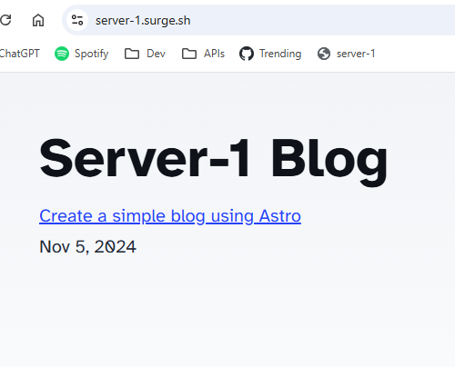

In the [last post](../create-simple-blog-using-astro/), we set up a simple blog using Astro. The next step is to make it available somewhere online. The simplest solution to do this (from previous experience) is to use [surge.sh](https://surge.sh/).


## How to do it?

The first step is to install Surge:

``` bash
npm install --global surge
```

After installation run surge from within any directory that you want to deploy, in my case with this Astro site, it is the `dist` folder (which I get by running `npm run build`):

``` bash
cd /path/to/directory/with/static/content
surge
```

When running the command I get prompted for the following input:
- email
- password
- project (defaults to the folder the command was executed from)
- domain (your-domain.surge.sh)

After all information is collected the site starts to deploy to Surge servers all over the world, and in just a couple of seconds the site is available:



Woho! That was quick.

## Deploy with npm

Next thing we will look into is how to deploy the site using npm.

First we need to install `surge` as a dev dependency in our project:

``` bash
npm install --save-dev surge
```

Then we need to add the deploy script to our `package.json`:

``` json
{
  "scripts": 
    { 
      "deploy": "surge ./dist server-1.surge.sh" 
      ...
    } 
}
```

When running `npm run deploy` the site now gets published to Surge!

There is another improvement we can do. In addition to the `surge` command we can make sure that the Astro site is built before we deploy, otherwise we might publish an old version of the site. This can be done by updating `package.json` like this:

``` json
{
  "scripts": 
    { 
      "deploy": "npm run build && surge ./dist server-1.surge.sh" 
      ...
    } 
}
```

With this configuration changes can always be published with a simple command. This is really nice! :-)

## Deploy on git push

To not miss publishing changes I would like to always deploy whenever I push changes to my git repository. This can be done by using something called git hooks. To use git hooks in a npm project we need to install [git-scripts](https://github.com/zixia/git-scripts):

``` bash
npm install --save-dev git-scripts
```

Now we can setup a git hook by adding the following to `package.json`:

``` json
{
  ...
  "git": {  
    "scripts": {  
      "pre-push": "npm run deploy"  
    }  
  }
}
```

Now when running `git push` a new deployment of the Astro site will be automatically triggered. This is nice, but there is one issue. If I work with multiple branches a push to any branch will trigger the hook. I only want to deploy when changes are published to the main branch.

To solve this we add a small JavaScript with a condition for when to run `npm run deploy`. I created `git-hooks/pre-push.js` within the Astro project:

``` js
import { execSync } from 'child_process';  
  
const branch = execSync('git rev-parse --abbrev-ref HEAD')
    .toString().trim();  

if (branch === 'main') {  
  execSync('npm run deploy', { stdio: 'inherit' })  
}
```

Then I update the pre-push hook in `package.json`:

``` json
{
  ...
  "git": {  
    "scripts": {  
      "pre-push": "node ./git-hooks/pre-push.js"  
    }  
  }
}
```

Now the site will only be deployed when changes are pushed to the `main` branch. Nice!

## What more?

For more information about what can be configured using surge, take a look at their [documentation page](https://surge.sh/help/). 

Thank you for reading!
