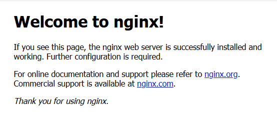

I have recently bought a new [Raspberry Pi 5](https://www.raspberrypi.com/products/raspberry-pi-5/) that I want to setup as a server for hosting hobby projects of mine. For doing that as simple and flexible as possible I want to setup a [docker](https://www.docker.com/) environment 🐳. I currently have a clean install of [Raspberry Pi OS Lite](https://www.raspberrypi.com/software/) 🍓. Lets see what it takes to install Docker! 

## Install Docker

First I want to do is to make sure that all packages are up to date when we start:

``` bash
sudo apt update && sudo apt upgrade -y
```

Then I install the some required packages:

``` bash
sudo apt install -y ca-certificates curl gnupg
```

After that we need to add Docker’s official GPG key:

``` bash
sudo mkdir -p /etc/apt/keyrings curl -fsSL https://download.docker.com/linux/debian/gpg | sudo gpg --dearmor -o /etc/apt/keyrings/docker.gpg
```

Then we setup the docker repository:

``` bash
echo "deb [arch=$(dpkg --print-architecture) signed-by=/etc/apt/keyrings/docker.gpg] https://download.docker.com/linux/debian $(lsb_release -cs) stable" | sudo tee /etc/apt/sources.list.d/docker.list > /dev/null
```

Then we update the package list and install docker:

``` bash
sudo apt update 
sudo apt install -y docker-ce docker-ce-cli containerd.io
```

Now we have docker installed. When running `docker --version` in the terminal I get this:

``` bash
Docker version 27.3.1, build ce12230
```

Add your user to the docker group:

``` bash
sudo usermod -aG docker $USER
```
## Install Docker Compose

To be able to execute apps and tools consisting of multiple containers we need to have [docker compose](https://docs.docker.com/compose/):

> Docker Compose is a tool for defining and running multi-container applications. It is the key to unlocking a streamlined and efficient development and deployment experience.
> 
> Compose simplifies the control of your entire application stack, making it easy to manage services, networks, and volumes in a single, comprehensible YAML configuration file. Then, with a single command, you create and start all the services from your configuration file.

To install docker compose we need to execute two commands. The first to download and put it in the correct place:

``` bash
sudo curl -L "https://github.com/docker/compose/releases/latest/download/docker-compose-$(uname -s)-$(uname -m)" -o /usr/local/bin/docker-compose
```

The other command is needed to make the downloaded file executable:

``` bash
sudo chmod +x /usr/local/bin/docker-compose
```

Now we can test docker compose by entering `docker-compose --version` in the terminal. Then I get the following:

``` bash
Docker Compose version v2.30.3
```

## Boot docker on startup

To ensure docker is started when the server starts we need to run the following:
``` bash
sudo systemctl enable docker
```

## Test our new setup

### Docker

The last thing I want to do is to make sure that everything is working as expected. To try out docker I can just run the [hello-world](https://hub.docker.com/_/hello-world) container like this:

``` bash
docker run hello-world
```

Then I get the following output:

``` bash
Unable to find image 'hello-world:latest' locally
latest: Pulling from library/hello-world
478afc919002: Pull complete
Digest: sha256:305243c734571da2d100c8c8b3c3167a098cab6049c9a5b066b6021a60fcb966
Status: Downloaded newer image for hello-world:latest

Hello from Docker!
This message shows that your installation appears to be working correctly.

To generate this message, Docker took the following steps:
 1. The Docker client contacted the Docker daemon.
 2. The Docker daemon pulled the "hello-world" image from the Docker Hub.
    (arm64v8)
 3. The Docker daemon created a new container from that image which runs the
    executable that produces the output you are currently reading.
 4. The Docker daemon streamed that output to the Docker client, which sent it
    to your terminal.
```

It works! 🎉

### Docker Compose

To test docker compose we need to add a simple `docker-compose.yml` like this:

``` yml
services:
  web:
    image: nginx
    ports:
      - "8080:80"
```

In the same folder as the `docker-compose.yml` is added I can then execute this command:

``` bash
docker-compose up
```

Then I get the following output:

``` bash
[+] Running 1/0
 ✔ Container david-web-1  Created                                                                0.0s
Attaching to web-1
web-1  | /docker-entrypoint.sh: /docker-entrypoint.d/ is not empty, will attempt to perform configuration
web-1  | /docker-entrypoint.sh: Looking for shell scripts in /docker-entrypoint.d/
web-1  | /docker-entrypoint.sh: Launching /docker-entrypoint.d/10-listen-on-ipv6-by-default.sh
web-1  | 10-listen-on-ipv6-by-default.sh: info: IPv6 listen already enabled
web-1  | /docker-entrypoint.sh: Sourcing /docker-entrypoint.d/15-local-resolvers.envsh
web-1  | /docker-entrypoint.sh: Launching /docker-entrypoint.d/20-envsubst-on-templates.sh
web-1  | /docker-entrypoint.sh: Launching /docker-entrypoint.d/30-tune-worker-processes.sh
web-1  | /docker-entrypoint.sh: Configuration complete; ready for start up
web-1  | 2024/11/15 22:49:09 [notice] 1#1: using the "epoll" event method
web-1  | 2024/11/15 22:49:09 [notice] 1#1: nginx/1.27.2
web-1  | 2024/11/15 22:49:09 [notice] 1#1: built by gcc 12.2.0 (Debian 12.2.0-14)
web-1  | 2024/11/15 22:49:09 [notice] 1#1: OS: Linux 6.6.51+rpt-rpi-2712
web-1  | 2024/11/15 22:49:09 [notice] 1#1: getrlimit(RLIMIT_NOFILE): 1048576:1048576
web-1  | 2024/11/15 22:49:09 [notice] 1#1: start worker processes
web-1  | 2024/11/15 22:49:09 [notice] 1#1: start worker process 22
web-1  | 2024/11/15 22:49:09 [notice] 1#1: start worker process 23
web-1  | 2024/11/15 22:49:09 [notice] 1#1: start worker process 24
web-1  | 2024/11/15 22:49:09 [notice] 1#1: start worker process 25
```

When opening a browser and going to `http://ip-of-my-server:8080` I get this:



Woho, we are on a roll, thank you for reading! 🍻


