I bought an [NVMe Base PCB with M.2 Slot from Pimoroni](https://shop.pimoroni.com/products/nvme-base?variant=41219587178579) to install an SSD to my Raspberry Pi 5. Actually I bought a kit including the SSD as well, since I read about some people having issues with compatibility so I thought it was worth getting a disk that is tested with the expansion card. The disk I received was an [ADATA 700 Legend](https://www.adata.com/en/consumer/category/ssds/solid-state-drives-legend-700/).
## Installation

I found this excellent guide:
https://learn.pimoroni.com/article/getting-started-with-nvme-base

The setup was pretty straight forward, but a bit fiddly with all the small parts. 

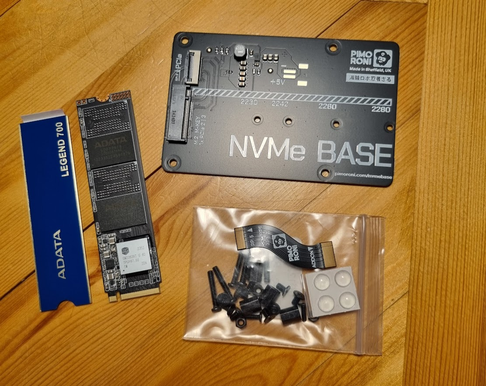

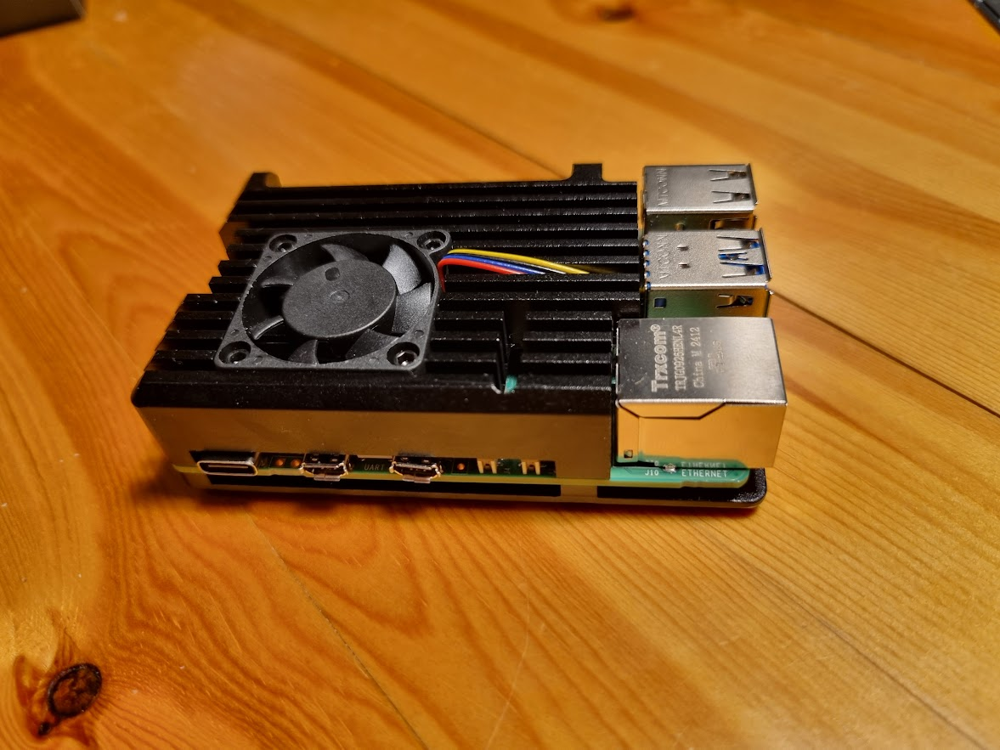

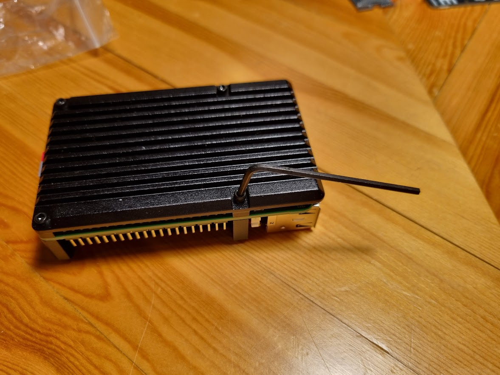

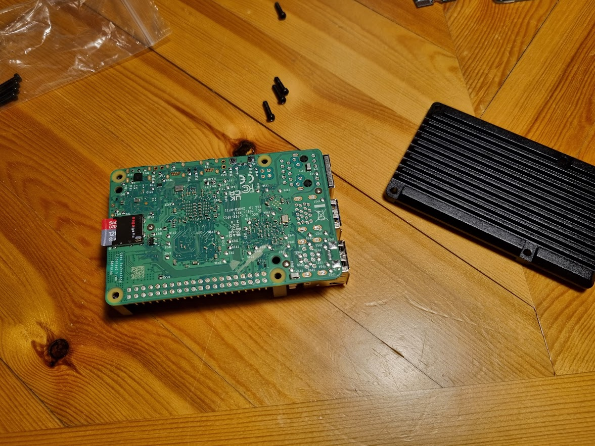

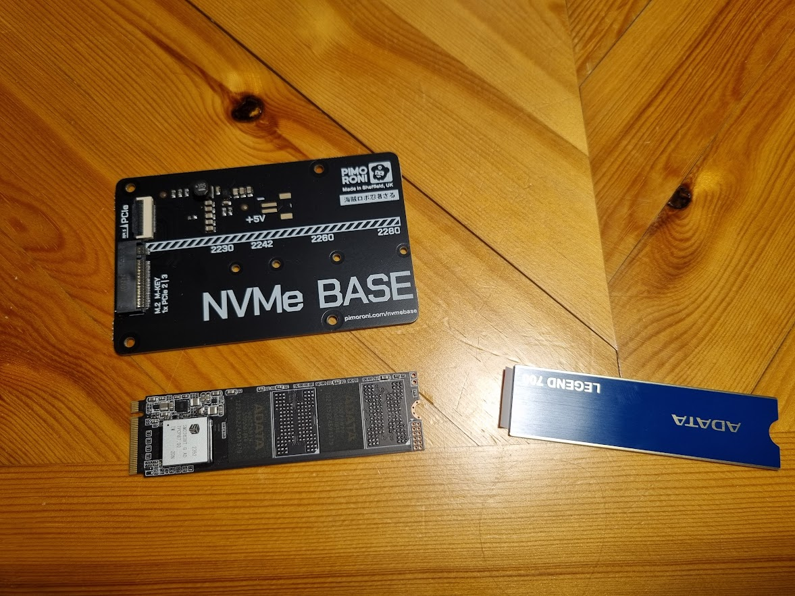

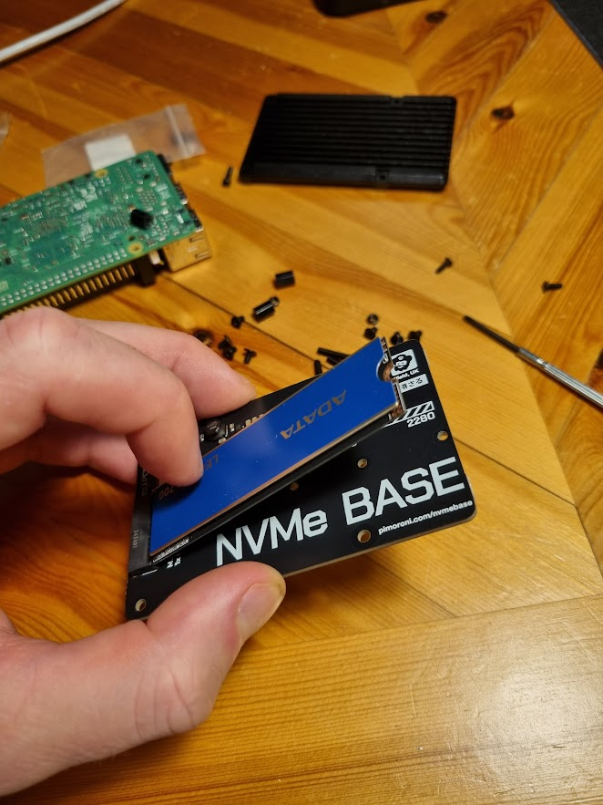

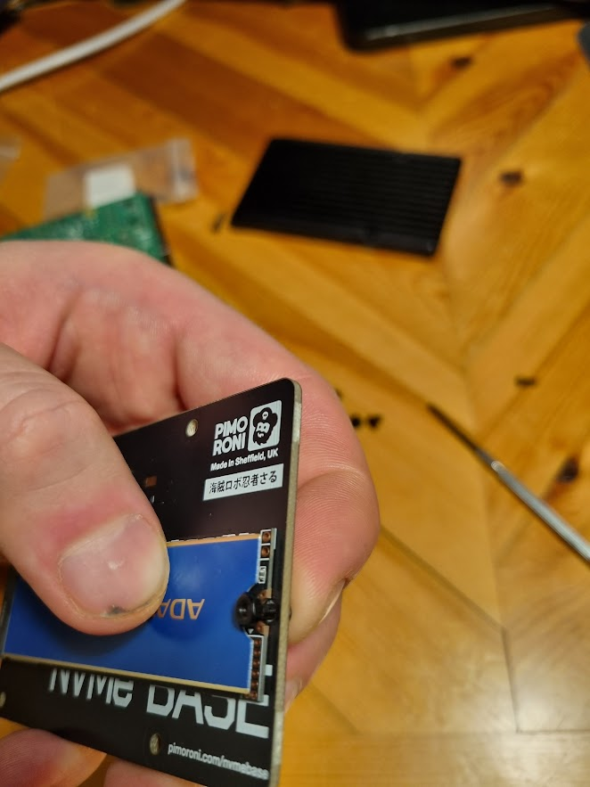

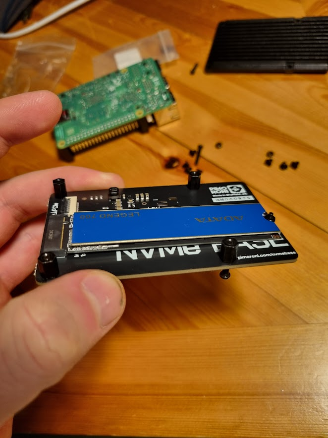

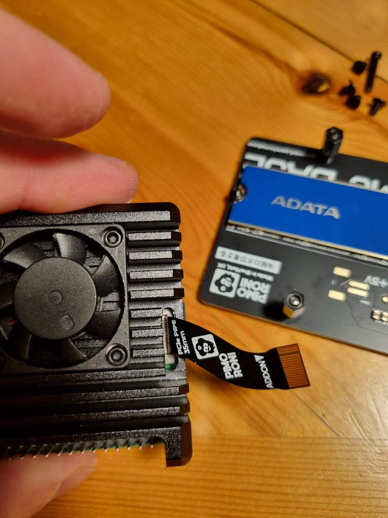

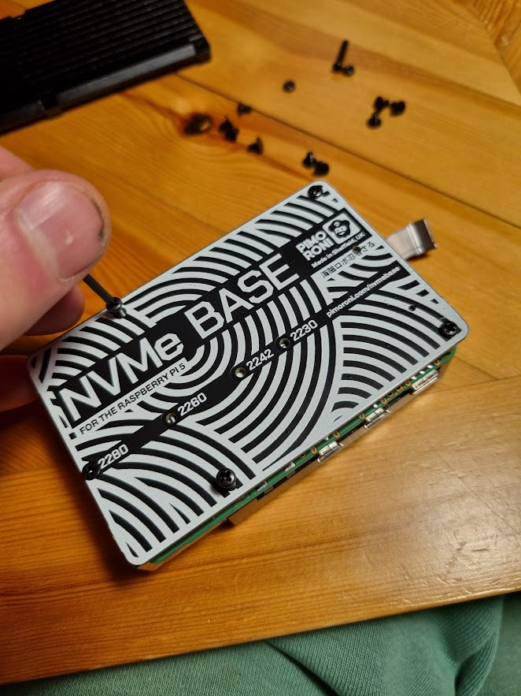

It was not possible to fit the bottom of my case together with the SSD hat, so I just skipped it. Might have worked with longer screws than those included.

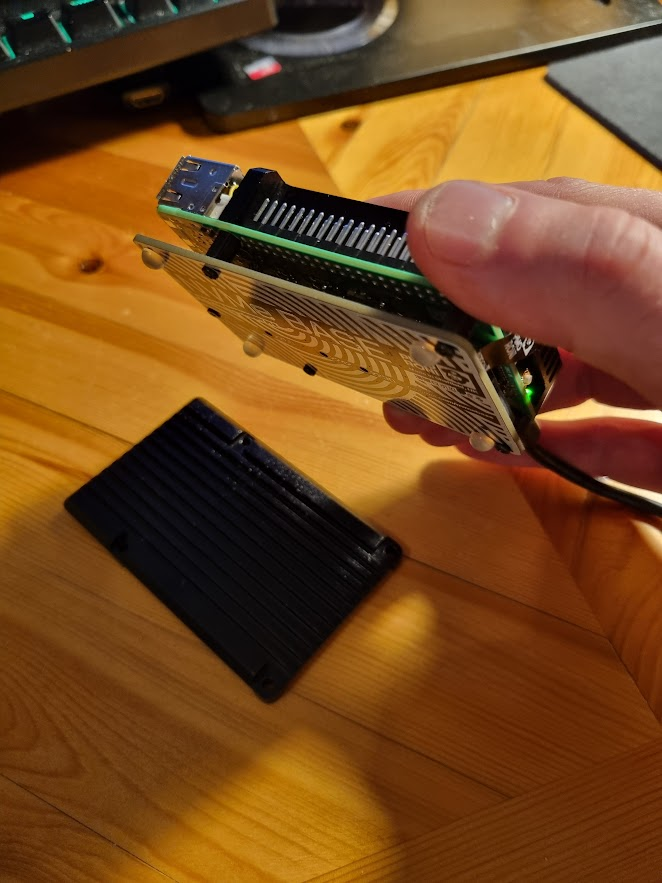
## Setup Raspberry Pi OS

After everything was put together I booted up the Raspberry. To enable the SSD we need to do some configuration. First I make sure we have the latest version of `raspi-config`:

``` bash
sudo apt update && sudo apt upgrade -y
```

Then we run it:

``` bash
sudo raspi-config
```

Go to `Advanced Options -> Bootloader version` and select `Latest`. 

When asked if you want to "Reset bootloader to default configuration", select `<No>`.

Select `Finish` and when prompted if you want to reboot select `<Yes>`.

When the Raspberry Pi has started again, to check if the disk was correctly connected and available you can run the following command:

``` bash
ls /dev/nvme0
```

If it works it should echo `/dev/nvme0` right back, then you´re all ready to go! 🎉

If you get an error you will have to shut down the Raspberry and make sure everything is connected correctly.

In my case it worked, so the next step is to make use of the SSD.
## Move OS from SD to SSD

Now when that is working I want to move my operating system from the SD card to SSD. When running Raspberry Pi OS Lite that can be done with this command:

``` bash
sudo dd if=/dev/mmcblk0 of=/dev/nvme0n1 status=progress
```

When the copy operation was done I shutdown the Raspberry, removed the SD card. When powered back up it just works just like before, but now from the SSD so hopefully faster and more reliable. Nice! 🥳

Thank you for reading!


