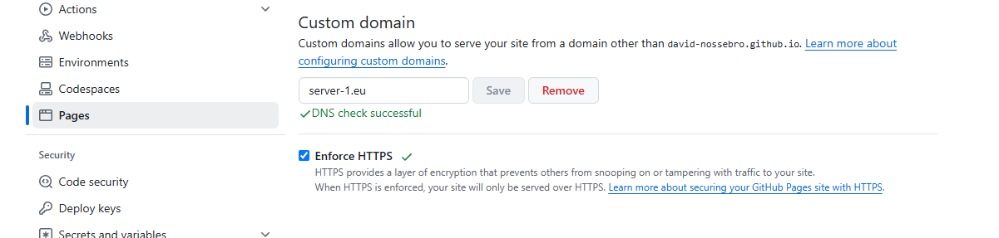

I have bought the domain [server-1.eu](https://server-1.eu) and want to use it as the url for this blog instead of the current subdomain for github.io. Lets see how we can set it up.

## How to configure the DNS?

After some searching in the Github documentation I found some information on how to:
[Managing a custom domain for your GitHub Pages site](https://docs.github.com/en/pages/configuring-a-custom-domain-for-your-github-pages-site/managing-a-custom-domain-for-your-github-pages-site#configuring-an-apex-domain)

At first I was not sure what an Apex domain was, so I hade to ask ChatGPT:

> An _Apex domain_ (or "root domain") is the highest level of a domain name without any subdomains or prefixes. For example, in `example.com`, "example.com" is the apex domain, whereas `www.example.com` includes a subdomain (`www`). Apex domains are often used in DNS configurations to point to the primary location of a website.

At my domain name provider ([GoDaddy](https://se.godaddy.com/)) I opened up the DNS setting for my new domain. 

I setup configurations for `A`, `AAAA` and `CNAME`:

| Type  | Name | Value               |
| ----- | ---- | ------------------- |
| A     | @    | 185.199.108.153     |
| AAAA  | @    | 2606:50c0:8000::153 |
| CNAME | www  | server-1.eu         |

- The `A` records with name `@` maps the root domain `server-1.eu` to the ip `185.199.108.153`, where the IP points to Github Pages servers.
- The `AAAA` does the exact same thing but for IPv6.
- The `CNAME` entry routes the subdomain `www.server-1.eu` to the root domain `server-1.eu`.

This is all configuration that is needed for the DNS.
## How to configure Github Pages?

I headed over to Github and opened up "Pages" under settings for my `david-nossebro.github.io` repository. There I found a field to configure a custom domain. After entered `server-1.eu` and clicket save it took some time for it to go through, and then I could also check the box for enforcing HTTPS:

An now to the final test. Is the page showing up when browsing to [server-1.eu](https://server-1.eu)? 

It works, I now have my own place at the world wide web! 🕸️

Thank you for reading. 🙏