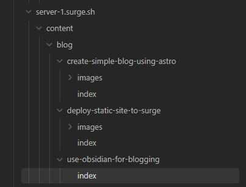
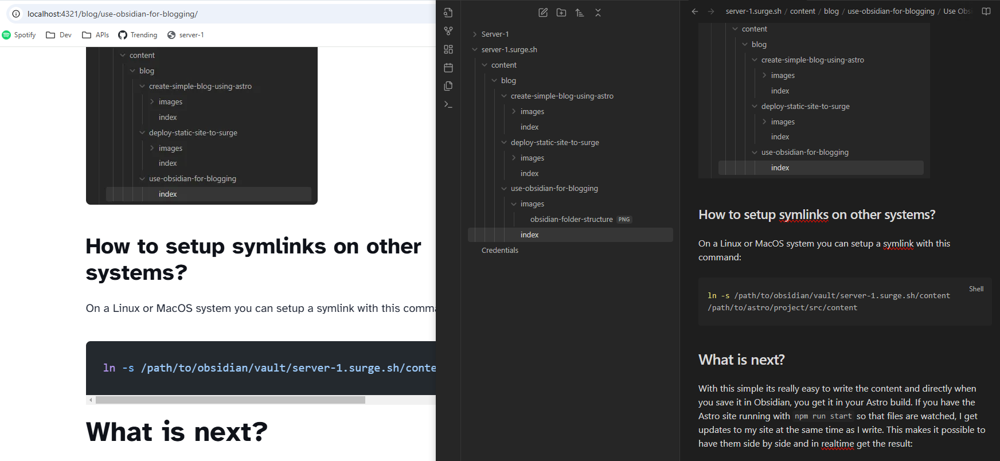
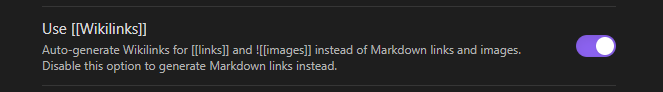

Since I am using [Obsidian](https://obsidian.md/) for structuring my personal notes and keeping my thoughts in order, and since it is an excellent editor for markdown documents, I though it might be a good idea to see if I can make it work for editing the content of this blog.

After trying some plugins for Obsidian for exporting and syncing markdown files that did not work so well, I stumbled on this video on Youtube:

[Simple way to integrate Astro with Obsidian](https://www.youtube.com/watch?v=dz3GOp4hN50)

In this video he have the simple, but brilliant idea to just create a symlink between a folder in your Obsidian vault and the content folder of your Astro blog.

## Setup symlink

So lets do it, and see how it all turns out (on my window machine). First I created a folder called `server-1.surge.sh` in my Obsidian vault. After that I ran this command to create the symlink:

```
mklink /D "C:\path\to\astro\project\src\content\" "C:\path\to\obsidian\vault\server-1.surge.sh\content"
```

After doing this I can see this in Obsidian:



On a **Linux** or **MacOS** system you can setup a symlink with this command:

``` bash
ln -s /path/to/obsidian/vault/server-1.surge.sh/content /path/to/astro/project/src/content
```

## How does it work?

With this simple its really easy to write the content and directly when you save it in Obsidian, you get it in your Astro build. If you have the Astro site running with `npm run start` so that files are watched, I get updates to my site at the same time as I write. This makes it possible to have them side by side and in realtime get the result:



## What is next?

One issue with this solution is that Obsidian has a slightly different format when pasting images into an article than what can be used with Astro.

Obsidian image format:

``` markdown
![[image.png]]
```

Astro need to have images in this format:

``` markdown
[Optional ALT text](./path/to/image.png))
```

This results in every time I paste an image I need to: 
1. Rename the image file
2. Move it into the `images` folder of the article I am currently writing
3. Update the link format

The positive thing here is that Obsidian handles both image formats.

After looking into settings in Obsidian I found that this behavior could be changed by toggling the following setting off: 



With this in place I am pretty happy with my setup and will definitely use Obsidian for my blogging. I will let you know if I find any more tweaks. 

Thank you for reading!