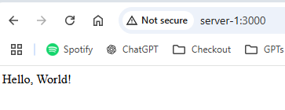

 Since JavaScript and NodeJS is all you actually need to write almost any application, and because I love the simplicity of writing and running JavaScript, I would like to be able to run the apps I write on my home server. 

In a previous article we covered how to [setup docker](../docker-on-raspberrypi5/index) 🐳. I could of course use docker to host my NodeJS apps, but since I imagine it will be the most common platform for the hobby projects I implement, and because of the overhead of hosting in a docker container, I want a setup where the NodeJS applications execute directly on the server with as little overhead as possible.  

## PM2

When reading about how to run NodeJS applications on a server, the most common way seems to be to use a tool called [PM2](https://pm2.keymetrics.io/). ChatGPT describes it like this 🤖:

> PM2 is a popular process manager for Node.js applications, designed to manage and monitor applications in production. It simplifies tasks like starting, stopping, restarting, and scaling applications, ensuring optimal performance and uptime. PM2 supports process clustering, allowing multiple instances of an application to run on multiple CPU cores for improved scalability. It includes features like log management, automatic restarts on crashes, and built-in load balancing. PM2 also integrates with monitoring tools, providing detailed metrics on application performance. Its easy-to-use CLI and ecosystem compatibility make it ideal for developers seeking efficient management of Node.js applications in server environments.

That sounds good, lets see how we can install it!

## Installation (on Debian system)

I assume that you have NodeJS installed when starting these steps. If not, start by installing NodeJS on you system.

To install PM2 on a Debian based system (like Raspberry Pi OS 🍓), the following steps are applicable:

Update the system package list:

``` bash
sudo apt update && sudo apt upgrade -y
```

Install PM2 and NodeJS globally:

``` bash
	sudo apt install -y nodejs
npm install -g pm2
```

Check the installed version to confirm PM2 is installed:

``` bash
pm2 --version
```

## Run something with PM2

Now we want to try it out by running something using PM2. Lets create a simple hello world app on the server:

Initialize a new Node.js project:

``` bash
mkdir hello-world-api 
cd hello-world-api 
npm init -y
```

Install Express:

``` bash
npm install express
```

Create the API: Create a file named `index.js` and add the following code:

``` js
const express = require('express');
const app = express();

const PORT = 3000;

// Define a simple route
app.get('/', (req, res) => {
    res.send('Hello, World!');
});

// Start the server
app.listen(PORT, () => {
    console.log(`Server is running at http://localhost:${PORT}`);
});
```

Now start the new app with PM2:

``` bash
pm2 start index.js --name hello-world-api
```

You should the see:
 
``` bash
[PM2] Starting /home/david/hello-world-api/index.js in fork_mode (1 instance)
[PM2] Done.
┌────┬────────────────────┬──────────┬──────┬───────────┬──────────┬──────────┐
│ id │ name               │ mode     │ ↺    │ status    │ cpu      │ memory   │
├────┼────────────────────┼──────────┼──────┼───────────┼──────────┼──────────┤
│ 0  │ hello-world-api    │ fork     │ 0    │ online    │ 0%       │ 35.5mb   │
└────┴────────────────────┴──────────┴──────┴───────────┴──────────┴──────────┘
```

When opening a browser and going to `http://server-hostname-or-ip:3000` I get the following:



So it works, nice! 🕺
## Start PM2 on startup

Configure PM2 to start automatically on system boot by running this command and follow the instructions.

``` bash
pm2 startup
```

When executed I got the following response on my machine:

``` bash
[PM2] Init System found: systemd
[PM2] To setup the Startup Script, copy/paste the following command:
sudo env PATH=$PATH:/home/myUser/.nvm/versions/node/v22.11.0/bin /home/myUser/.nvm/versions/node/v22.11.0/lib/node_modules/pm2/bin/pm2 startup systemd -u myUser --hp /home/myUser
```

Now make sure that the `hello-world-api` is still running with:

``` bash
pm2 list
```

If it is not listed, start it again. Then run the following to save the current process list so that it boots on startup:

``` bash
pm2 save
```

Now, lets try to reboot the server and see if PM2 is automatically started with the system:

``` bash
sudo reboot
```

After reboot I can still see the `hello-world-api` when running `pm2 list`. It is also available from the browser. BIG SUCCESS! 🎉

Thank you for reading!

