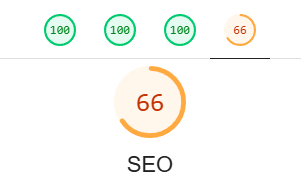
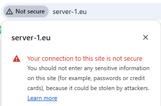

After the quick setup of Surge as hosting platform for this blog I was very pleased with the simplicity. Unfortunately I stumbled into some issues (which is partly due to me being stingy). 

## The problem

When running the [Lighthouse](https://developer.chrome.com/docs/lighthouse/overview) analysis on the hosted site (using the free [server-1.surge.sh](https://server-1.surge.sh) url) I got a really bad scoring on SEO:



When looking into why I realized that the problem is that Surge adds a robot.txt that does not allow crawlers on my site:

```
User-agent: *
Disallow: /
```

After googling the issue I found out that this is by design in this [issue](https://github.com/sintaxi/surge/issues/288) on github. This is the response from [sintaxi](https://github.com/sintaxi) who owns the [Surge repo](https://github.com/sintaxi/surge/):

> For obvious reasons we don't permit search engine indexing on our own domain with other users content. Using a throwaway account to file this issue does not compel me believe the policy is incorrect. A `robots.txt` works as expected with a custom domain.

So with that information I thought I get a cheap domain (something I was thinking of doing anyway). Said and done I bought [server-1.eu](https://server-1.eu) and had it configured for Surge followng the [docs](https://surge.sh/help/adding-a-custom-domain). 

Now the next issue arise:



I headed over to the documentation for Surge and found that I could force a redirect from http to https by providing `https` in the domain name on deploy:

```
surge --domain https://my-project.surge.sh
```

[https://surge.sh/help/using-https-by-default](https://surge.sh/help/using-https-by-default)

However for a custom domain I need to add my own SSL certificate, but that is only available if I upgrade to [Surge Plus ](https://surge.sh/plus/). 

For my personal blog I do not think it is worth spending 30$ a month for hosting. If I had a professional site it would not be a lot of money, but since this is just a hobby, and I do not really count on getting many visitors I became stingy.

## Whats next?

Next thing to do will be to explore some other options:

- [Hosting it on my own hardware](https://pimylifeup.com/raspberry-pi-nginx/)
- [Vercel](https://vercel.com/)
- [Netlify](https://www.netlify.com/)
- [Github pages](https://pages.github.com/)
- [Render](https://render.com/)

Until then, thank you for reading!